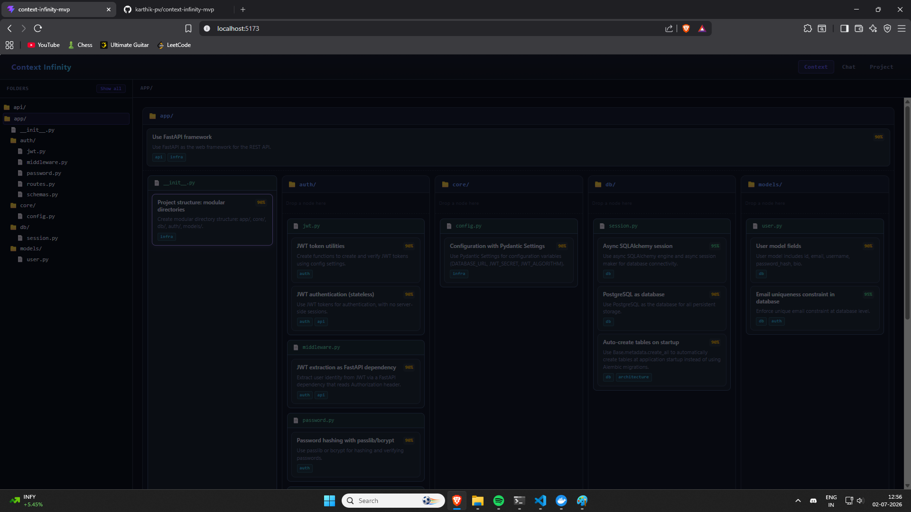
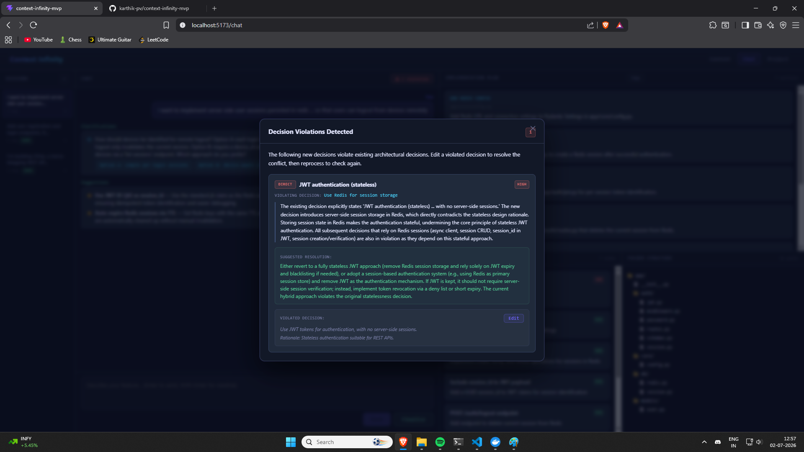
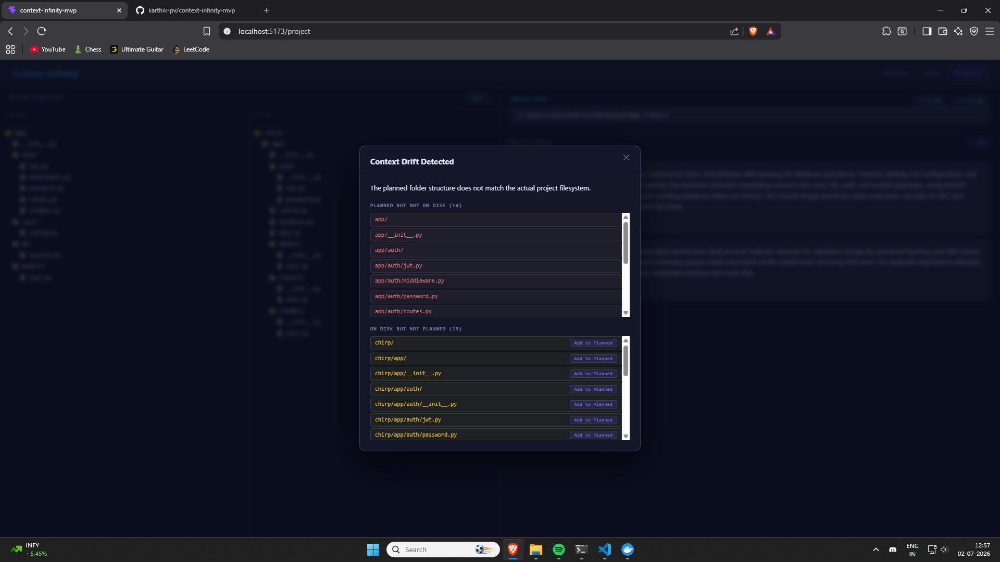

# Context Infinity

Architectural memory for AI-assisted development — acts as a guardrail that prevents LLM-generated code from violating previously established architectural decisions.

## The Problem

When developers use LLMs to plan and implement features across multiple sessions, the LLM has no memory of past architectural decisions. This leads to:

- **Decision drift** — new code contradicts earlier choices (e.g., "use JWT" in session 1, "use session auth" in session 3)
- **Context loss** — each session starts blank, repeating or undoing prior work
- **No enforcement** — nothing checks if new plans respect the existing architecture

## The Solution — 4-Stage Multi-Pass Pipeline

Instead of one giant LLM prompt, each user message flows through four narrow stages. Each stage does one job, keeping prompts small and token growth proportional to relevant context.

```
User Message
    │
    ▼
Stage 1: Planner           → plan/folder mutations + clarifications + suggestions
Stage 2: Decision Extractor → extract architectural decisions from plan changes
Stage 3: Retrieval          → fetch relevant historical decisions from DB (no LLM)
Stage 4: Violation Checker  → compare new decisions vs historical, flag conflicts
    │
    ▼
Updated session state → UI renders plan, decisions, violations, clarifications
```

| Stage | LLM? | Input | Output |
|-------|------|-------|--------|
| 1 — Planner | Yes | Plan + folders + user message | Plan mutations, folder mutations, clarifications, suggestions |
| 2 — Decision Extractor | Yes | User message + plan changes + existing decisions | Decision mutations (add/update/delete) |
| 3 — Retrieval | No | Decision target files + tags | Relevant historical decisions (tiered scoring) |
| 4 — Violation Checker | Yes | New decisions + historical decisions | Violations with type, severity, suggested resolution |

**Key design principle:** The planner never sees historical decisions. Violation checking is done by a separate LLM that compares new vs. old — keeping each prompt focused and impartial.

## Screenshots

### Context Page — All Decisions

Hierarchical folder tree with decision cards placed at their artifact locations. Click a folder or file to filter the view.



### Violation Detection

When a new decision conflicts with a historical one, the violation modal shows the conflict with severity, explanation, and suggested resolution. Edit the violated decision inline and reprocess to re-check.



### Context Drift Detection

Sync the planned folder structure against the actual filesystem. Anomalies (files on disk but not planned, or planned but missing) are surfaced with the ability to add missing paths into the planned structure.



## Tech Stack

- **Backend:** FastAPI, PostgreSQL, raw `psycopg` (no ORM)
- **LLM Adapters:** Anthropic, OpenAI, Fireworks (swappable via config)
- **Frontend:** React, Vite, dnd-kit (drag-and-drop for decision placement)
- **Pipeline:** Hand-rolled async pipeline (no LangChain — 4 function calls in sequence)
